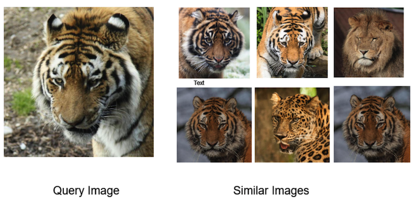

[](https://badge.fury.io/py/similarities)
[](https://pepy.tech/project/similarities)
[](CONTRIBUTING.md)
[](https://github.com/shibing624/similarities/graphs/contributors)
[](LICENSE)
[](requirements.txt)
[](https://github.com/shibing624/similarities/issues)
[](#Contact)

# Similarities
Similarities is a toolkit for similarity calculation and semantic search, supports text and image. 

similarities：相似度计算、语义匹配搜索工具包。

**similarities** 实现了多种相似度计算、匹配搜索算法，支持文本、图像，python3开发，pip安装，开箱即用。


**Guide**
- [Feature](#Feature)
- [Install](#install)
- [Usage](#usage)
- [Contact](#Contact)
- [Citation](#Citation)
- [Reference](#reference)

# Feature

### 文本相似度比较方法

- 余弦相似（Cosine Similarity）：两向量求余弦
- 点积（Dot Product）：两向量归一化后求内积
- [RankBM25](similarities/literalsim.py)：BM25的变种算法，对query和文档之间的相似度打分，得到docs的rank排序
- [SemanticSearch](https://github.com/shibing624/similarities/blob/main/similarities/similarity.py#L99)：向量相似检索，使用Cosine Similarty + topk高效计算，比一对一暴力计算快一个数量级


# Demo

Official Demo: http://42.193.145.218/product/short_text_sim/

HuggingFace Demo: https://huggingface.co/spaces/shibing624/text2vec


# Install
```
pip3 install torch # conda install pytorch
pip3 install -U similarities
```

or

```
git clone https://github.com/shibing624/similarities.git
cd similarities
python3 setup.py install
```

# Usage

### 1. 文本语义相似度计算

```shell
>>> from similarities import Similarity

>>> m = Similarity("shibing624/text2vec-base-chinese")
>>> r = m.similarity('如何更换花呗绑定银行卡', '花呗更改绑定银行卡')
>>> print(f"similarity score: {r:.4f}")
similarity score: 0.8551
```

> 余弦值`score`范围是[-1, 1]，值越大越相似。

### 2. 文本语义匹配搜索

一般在文档候选集中找与query最相似的文本，常用于QA场景的问句相似匹配、文本相似检索等任务。


中文示例[examples/base_demo.py](./examples/base_demo.py)

```python
import sys

sys.path.append('..')
from similarities import Similarity

# 1.Compute cosine similarity between two sentences.
sentences = ['如何更换花呗绑定银行卡',
             '花呗更改绑定银行卡']
corpus = [
    '花呗更改绑定银行卡',
    '我什么时候开通了花呗',
    '俄罗斯警告乌克兰反对欧盟协议',
    '暴风雨掩埋了东北部；新泽西16英寸的降雪',
    '中央情报局局长访问以色列叙利亚会谈',
    '人在巴基斯坦基地的炸弹袭击中丧生',
]
model = Similarity("shibing624/text2vec-base-chinese")
print(model)
similarity_score = model.similarity(sentences[0], sentences[1])
print(f"{sentences[0]} vs {sentences[1]}, score: {float(similarity_score):.4f}")

# 2.Compute similarity between two list
similarity_scores = model.similarity(sentences, corpus)
print(similarity_scores.numpy())
for i in range(len(sentences)):
    for j in range(len(corpus)):
        print(f"{sentences[i]} vs {corpus[j]}, score: {similarity_scores.numpy()[i][j]:.4f}")

# 3.Semantic Search
model.add_corpus(corpus)
q = '如何更换花呗绑定银行卡'
print("query:", q)
for i in model.most_similar(q, topn=5):
    print('\t', i)
```

output:
```shell
如何更换花呗绑定银行卡 vs 花呗更改绑定银行卡, score: 0.8551
...

如何更换花呗绑定银行卡 vs 花呗更改绑定银行卡, score: 0.8551
如何更换花呗绑定银行卡 vs 我什么时候开通了花呗, score: 0.7212
如何更换花呗绑定银行卡 vs 俄罗斯警告乌克兰反对欧盟协议, score: 0.1450
如何更换花呗绑定银行卡 vs 暴风雨掩埋了东北部；新泽西16英寸的降雪, score: 0.2167
如何更换花呗绑定银行卡 vs 中央情报局局长访问以色列叙利亚会谈, score: 0.2517
如何更换花呗绑定银行卡 vs 人在巴基斯坦基地的炸弹袭击中丧生, score: 0.0809
花呗更改绑定银行卡 vs 花呗更改绑定银行卡, score: 1.0000
花呗更改绑定银行卡 vs 我什么时候开通了花呗, score: 0.6807
花呗更改绑定银行卡 vs 俄罗斯警告乌克兰反对欧盟协议, score: 0.1714
花呗更改绑定银行卡 vs 暴风雨掩埋了东北部；新泽西16英寸的降雪, score: 0.2162
花呗更改绑定银行卡 vs 中央情报局局长访问以色列叙利亚会谈, score: 0.2728
花呗更改绑定银行卡 vs 人在巴基斯坦基地的炸弹袭击中丧生, score: 0.1279

query: 如何更换花呗绑定银行卡
	 (0, '花呗更改绑定银行卡', 0.8551459908485413)
	 (1, '我什么时候开通了花呗', 0.721195638179779)
	 (4, '中央情报局局长访问以色列叙利亚会谈', 0.2517135739326477)
	 (3, '暴风雨掩埋了东北部；新泽西16英寸的降雪', 0.21666759252548218)
	 (2, '俄罗斯警告乌克兰反对欧盟协议', 0.1450251191854477)
```
> 余弦`score`的值范围[-1, 1]，值越大，表示该query与corpus的文本越相似。


英文示例[examples/base_english_demo.py](./examples/base_english_demo.py)


### 3. 快速近似语义匹配搜索

支持Annoy、Hnswlib的近似语义匹配搜索，常用于百万数据集的匹配搜索任务。


示例[examples/fast_sim_demo.py](./examples/fast_sim_demo.py)


### 4. 基于字面的文本相似度计算和匹配搜索

支持同义词词林（Cilin）、知网Hownet、词向量（WordEmbedding）、Tfidf、SimHash、BM25等算法的相似度计算和字面匹配搜索，常用于文本匹配冷启动。

示例[examples/literal_sim_demo.py](./examples/literal_sim_demo.py)

```python
from similarities.literalsim import SimHashSimilarity, TfidfSimilarity, BM25Similarity, \
    WordEmbeddingSimilarity, CilinSimilarity, HownetSimilarity

text1 = "如何更换花呗绑定银行卡"
text2 = "花呗更改绑定银行卡"

m = TfidfSimilarity()
print(text1, text2, ' sim score: ', m.similarity(text1, text2))

zh_list = ['刘若英是个演员', '他唱歌很好听', 'women喜欢这首歌', '我不是演员吗']
m.add_corpus(zh_list)
print(m.most_similar('刘若英是演员'))
```

output:
```shell
如何更换花呗绑定银行卡 花呗更改绑定银行卡  sim score:  0.8203384355246909

[(0, '刘若英是个演员', 0.9847577834309504), (3, '我不是演员吗', 0.7056381915655814), (1, '他唱歌很好听', 0.5), (2, 'women喜欢这首歌', 0.5)]
```

### 5. 图像相似度计算和匹配搜索

支持[CLIP](similarities/imagesim.py)、pHash、SIFT等算法的图像相似度计算和匹配搜索。

示例[examples/image_demo.py](./examples/image_demo.py)

```python
import sys
import glob

sys.path.append('..')
from similarities.imagesim import ImageHashSimilarity, SiftSimilarity, ClipSimilarity

image_fp1 = 'data/image1.png'
image_fp2 = 'data/image12-like-image1.png'
m = ClipSimilarity()
print(m)
print(m.similarity(image_fp1, image_fp2))
# add corpus
m.add_corpus(glob.glob('data/*.jpg') + glob.glob('data/*.png'))
r = m.most_similar(image_fp1)
print(r)
```

output:
```shell
0.9579

[(6, 'data/image1.png', 1.0), (0, 'data/image12-like-image1.png', 0.9579654335975647), (4, 'data/image8-like-image1.png', 0.9326782822608948), ... ]
```


# Contact

- Issue(建议)：[](https://github.com/shibing624/similarities/issues)
- 邮件我：xuming: xuming624@qq.com
- 微信我：
加我*微信号：xuming624, 备注：姓名-公司-NLP* 进NLP交流群。


# Citation

如果你在研究中使用了similarities，请按如下格式引用：

APA:
```
Xu, M. Similarities: Compute similarity score for humans (Version 0.0.4) [Computer software]. https://github.com/shibing624/similarities
```

BibTeX:
```
@software{Xu_Similarities_Compute_similarity,
author = {Xu, Ming},
title = {Similarities: similarity calculation and semantic search toolkit},
url = {https://github.com/shibing624/similarities},
version = {0.0.4}
}
```

# License


授权协议为 [The Apache License 2.0](/LICENSE)，可免费用做商业用途。请在产品说明中附加similarities的链接和授权协议。


# Contribute
项目代码还很粗糙，如果大家对代码有所改进，欢迎提交回本项目，在提交之前，注意以下两点：

 - 在`tests`添加相应的单元测试
 - 使用`python setup.py test`来运行所有单元测试，确保所有单测都是通过的

之后即可提交PR。

# Reference
- [A Simple but Tough-to-Beat Baseline for Sentence Embeddings[Sanjeev Arora and Yingyu Liang and Tengyu Ma, 2017]](https://openreview.net/forum?id=SyK00v5xx)
- [liuhuanyong/SentenceSimilarity](https://github.com/liuhuanyong/SentenceSimilarity)
- [shibing624/text2vec](https://github.com/shibing624/text2vec)
- [qwertyforce/image_search](https://github.com/qwertyforce/image_search)
- [ImageHash - Official Github repository](https://github.com/JohannesBuchner/imagehash)